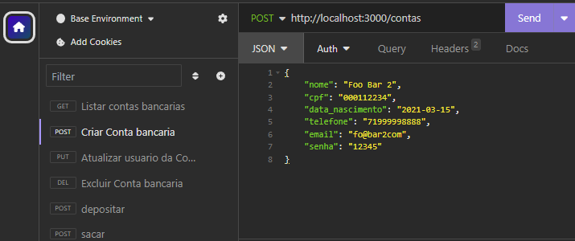
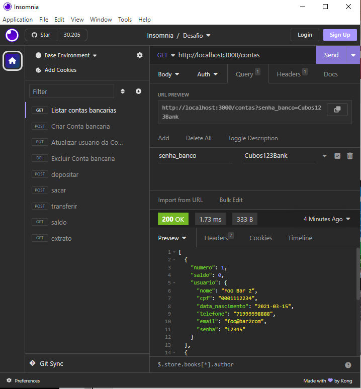

# Desafio Módulo 2 - Back-end

## Descrição do Projeto

Projeto feito para ser entregue como solução do desafio do módulo 2 do curso de Desenvolvimento de Software com foco em Back-End da Cubos Academy com parceria com o iFood. 

Trata-se da criação de um RESTful API de um Banco Digital, que realiza operações bancárias como a criação de contas, atualização de dados de usuário, depósitos, saques, transferências, visualização do saldo e emissão de extrato bancário.


## Funcionalidades

* Listar contas bancárias
* Criar conta bancária
* Atualizar os dados do usuário da conta bancária
* Excluir uma conta bancária
* Depositar em uma conta bancária
* Sacar de uma conta bancária
* Transferir valores entre contas bancárias
* Consultar saldo da conta bancária
* Emitir extrato bancário

## Tecnologias e Ferramentas utilizadas

* Javascript
* Node.js
* Nodemon
* Express
* Imsonia

## Execução do Projeto

### Instalação:
```javascript
    npm install
    npm install express
    npm install -D nodemon
```
### Iniciar:
```javascript
    npm run dev
```

## Endpoints

Endpoints   | Método | Funcionalidade 
--------- | ------ | --------------
/contas | GET | Lista todas as contas
/contas	| POST |Cria uma nova conta 
/contas/:numero_conta/usuario | PUT |	Atualizar os dados de usuário de uma conta
/contas/:numero_conta	| DELET | Exclui uma conta	
/transacoes/depositar	| POST | Deposita em uma conta existente	
/transacoes/sacar |	POST | Saque em uma conta existente	
/transacoes/transferir	| POST | Transferência entre duas contas existentes	
/contas/saldo |	GET | Consulta o saldo de uma conta
/contas/extrato	| GET | Emissão do extrato bancário

## Persistências dos dados

Os dados serão persistidos em memória, no objeto existente dentro do arquivo `bancodedados.js`. 

### Estrutura do objeto no arquivo `bancodedados.js`

```javascript
{
    banco: {
        nome: "Cubos Bank",
        numero: "123",
        agencia: "0001",
        senha: "Cubos123Bank",
    },
    contas: [
        // array de contas bancárias
    ],
    saques: [
        // array de saques
    ],
    depositos: [
        // array de depósitos
    ],
    transferencias: [
        // array de transferências
    ],
}
```

### Listar contas bancárias

#### `GET` `/contas?senha_banco=Cubos123Bank`

Esse endpoint lista todas as contas bancárias existentes.

-   **Requisição** - query params 

    -   senha_banco

-   **Resposta**
    -   listagem de todas as contas bancárias existentes

#### Exemplo de resposta

```javascript
// HTTP Status 200 / 201 / 204
// 2 contas encontradas
[
    {
        "numero": "1",
        "saldo": 0,
        "usuario": {
            "nome": "Foo Bar",
            "cpf": "00011122233",
            "data_nascimento": "2021-03-15",
            "telefone": "71999998888",
            "email": "foo@bar.com",
            "senha": "1234"
        }
    },
    {
        "numero": "2",
        "saldo": 1000,
        "usuario": {
            "nome": "Foo Bar 2",
            "cpf": "00011122234",
            "data_nascimento": "2021-03-15",
            "telefone": "71999998888",
            "email": "foo@bar2.com",
            "senha": "12345"
        }
    }
]

// nenhuma conta encontrada
[]
```
```javascript
// HTTP Status 400 / 401 / 403 / 404
{
    "mensagem": "A senha do banco informada é inválida!"
}
```

### Criar conta bancária

#### `POST` `/contas`

Esse endpoint cria uma conta bancária, onde será gerado um número único para identificação da conta (número da conta).

-   **Requisição** - O corpo (body) deverá possuir um objeto com as seguintes propriedades (respeitando estes nomes):

    -   nome
    -   cpf
    -   data_nascimento
    -   telefone
    -   email
    -   senha


#### Exemplo de Requisição

```javascript
// POST /contas
{
    "nome": "Foo Bar 2",
    "cpf": "00011122234",
    "data_nascimento": "2021-03-15",
    "telefone": "71999998888",
    "email": "foo@bar2.com",
    "senha": "12345"
}
```

#### Exemplo de Resposta

```javascript
// HTTP Status 200 / 201 / 204
// Sem conteúdo no corpo (body) da resposta
```
```javascript
// HTTP Status 400 / 401 / 403 / 404
{
    "mensagem": "Já existe uma conta com o cpf ou e-mail informado!"
}
```

### Atualizar usuário da conta bancária

#### `PUT` `/contas/:numeroConta/usuario`

Esse endpoint atualiza apenas os dados do usuário de uma conta bancária.


-   **Requisição** - O corpo (body) deverá possuir um objeto com todas as seguintes propriedades (respeitando estes nomes):

    -   nome
    -   cpf
    -   data_nascimento
    -   telefone
    -   email
    -   senha

#### Exemplo de Requisição
```javascript
// PUT /contas/:numeroConta/usuario
{
    "nome": "Foo Bar 3",
    "cpf": "99911122234",
    "data_nascimento": "2021-03-15",
    "telefone": "71999998888",
    "email": "foo@bar3.com",
    "senha": "12345"
{
```


#### Exemplo de Resposta

```javascript
// HTTP Status 200 / 201 / 204
// Sem conteúdo no corpo (body) da resposta
```
```javascript
// HTTP Status 400 / 401 / 403 / 404
{
    "mensagem": "O CPF informado já existe cadastrado!"
}
```

### Excluir Conta

#### `DELETE` `/contas/:numeroConta`

Esse endpoint exclui uma conta bancária existente.

-   **Requisição**

    -   Numero da conta bancária (passado como parâmetro na rota)


#### Exemplo de Resposta

```javascript
// HTTP Status 200 / 201 / 204
// Sem conteúdo no corpo (body) da resposta
```
```javascript
// HTTP Status 400 / 401 / 403 / 404
{
    "mensagem": "A conta só pode ser removida se o saldo for zero!"
}
```

### Depositar

#### `POST` `/transacoes/depositar`

Esse endpoint soma o valor do depósito ao saldo de uma conta válida e registra essa transação.


-   **Requisição** - O corpo (body) deverá possuir um objeto com as seguintes propriedades (respeitando estes nomes):

    -   numero_conta
    -   valor


#### Exemplo de Requisição
```javascript
// POST /transacoes/depositar
{
	"numero_conta": "1",
	"valor": 1900
}
```

#### Exemplo de Resposta

```javascript
// HTTP Status 200 / 201 / 204
// Sem conteúdo no corpo (body) da resposta
```
```javascript
// HTTP Status 400 / 401 / 403 / 404
{
    "mensagem": "O número da conta e o valor são obrigatórios!"
}
```

#### Exemplo do registro de um depósito

```javascript
{
    "data": "2021-08-10 23:40:35",
    "numero_conta": "1",
    "valor": 10000
}
```

### Sacar

#### `POST` `/transacoes/sacar`

Esse endpoint realiza o saque de um valor em uma determinada conta bancária e registra essa transação.


-   **Requisição** - O corpo (body) deverá possuir um objeto com as seguintes propriedades (respeitando estes nomes):

    -   numero_conta
    -   valor
    -   senha

#### Exemplo de Requisição
```javascript
// POST /transacoes/sacar
{
	"numero_conta": "1",
	"valor": 1900,
    "senha": "123456"
}
```
#### Exemplo de Resposta
```javascript
// HTTP Status 200 / 201 / 204
// Sem conteúdo no corpo (body) da resposta
```
```javascript
// HTTP Status 400 / 401 / 403 / 404
{
    "mensagem": "O valor não pode ser menor que zero!"
}
```

#### Exemplo do registro de um saque

```javascript
{
    "data": "2021-08-10 23:40:35",
    "numero_conta": "1",
    "valor": 10000
}
```

### Tranferir

#### `POST` `/transacoes/transferir`

Esse endpoint permite a transferência de recursos de uma conta bancária para outra e registra essa transação.


-   **Requisição** - O corpo (body) deverá possuir um objeto com as seguintes propriedades (respeitando estes nomes):

    -   numero_conta_origem
    -   numero_conta_destino
    -   valor
    -   senha

#### Exemplo de Requisição
```javascript
// POST /transacoes/transferir
{
	"numero_conta_origem": "1",
	"numero_conta_destino": "2",
	"valor": 200,
	"senha": "123456"
}
```
#### Exemplo de Resposta

```javascript
// HTTP Status 200 / 201 / 204
// Sem conteúdo no corpo (body) da resposta
```
```javascript
// HTTP Status 400 / 401 / 403 / 404
{
    "mensagem": "Saldo insuficiente!"
}
```

#### Exemplo do registro de uma transferência

```javascript
{
    "data": "2021-08-10 23:40:35",
    "numero_conta_origem": "1",
    "numero_conta_destino": "2",
    "valor": 10000
}
```

### Saldo

#### `GET` `/contas/saldo?numero_conta=123&senha=123`

Esse endpoint retorna o saldo de uma conta bancária.

-   **Requisição** - query params

    -   numero_conta
    -   senha

-   **Resposta**

    -   Saldo da conta

#### Exemplo de Resposta

```javascript
// HTTP Status 200 / 201 / 204
{
    "saldo": 13000
}
```
```javascript
// HTTP Status 400 / 401 / 403 / 404
{
    "mensagem": "Conta bancária não encontada!"
}
```

### Extrato

#### `GET` `/contas/extrato?numero_conta=123&senha=123`

Esse endpoint lista as transações realizadas de uma conta específica.

-   **Requisição** - query params

    -   numero_conta
    -   senha

-   **Resposta**
    -   Relatório da conta

#### Exemplo de Resposta

```javascript
// HTTP Status 200 / 201 / 204
{
  "depositos": [
    {
      "data": "2021-08-18 20:46:03",
      "numero_conta": "1",
      "valor": 10000
    },
    {
      "data": "2021-08-18 20:46:06",
      "numero_conta": "1",
      "valor": 10000
    }
  ],
  "saques": [
    {
      "data": "2021-08-18 20:46:18",
      "numero_conta": "1",
      "valor": 1000
    }
  ],
  "transferenciasEnviadas": [
    {
      "data": "2021-08-18 20:47:10",
      "numero_conta_origem": "1",
      "numero_conta_destino": "2",
      "valor": 5000
    }
  ],
  "transferenciasRecebidas": [
    {
      "data": "2021-08-18 20:47:24",
      "numero_conta_origem": "2",
      "numero_conta_destino": "1",
      "valor": 2000
    },
    {
      "data": "2021-08-18 20:47:26",
      "numero_conta_origem": "2",
      "numero_conta_destino": "1",
      "valor": 2000
    }
  ]
}
```

#### Imagens






###### tags: `back-end` `módulo 2` `nodeJS` `API REST` `desafio`
